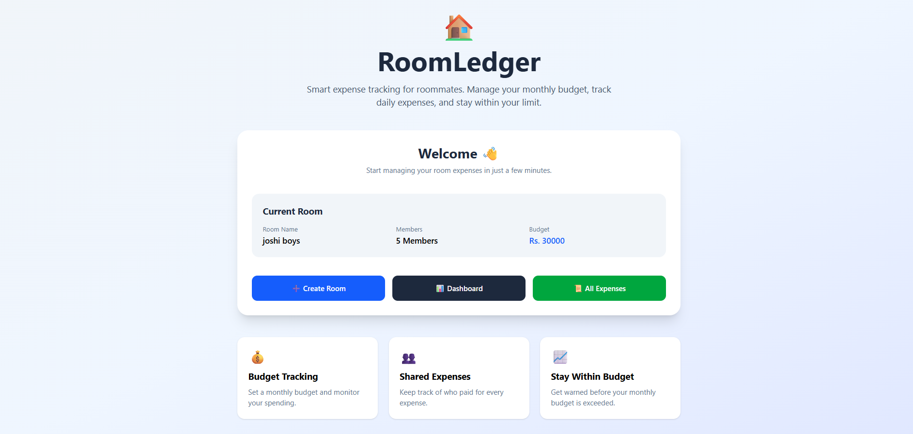
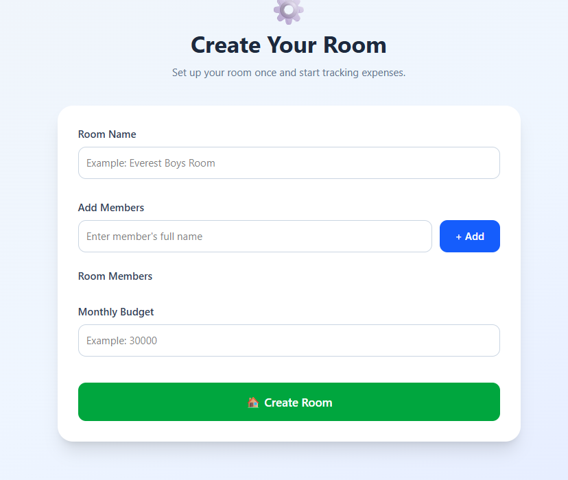
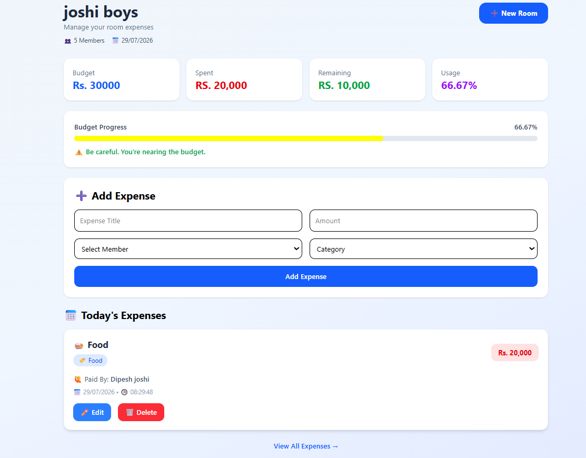

# 🏠 RoomLedger

RoomLedger is a simple room expense management web application built using **HTML, Tailwind CSS, and Vanilla JavaScript**.

It helps roommates keep track of their shared expenses, monitor the room budget, and manage spending in one place.

---

## ✨ Features

- 🏠 Create a new room
- 👥 Manage room members
- 💰 Set room budget
- ➕ Add new expenses
- ✏️ Edit existing expenses
- 🗑 Delete expenses
- 📊 Live budget calculation
- 📈 Budget usage progress bar
- 💵 Remaining budget tracker
- 📅 Automatic expense date and time
- 💾 LocalStorage support (data persists after refresh)
- 🔄 Create a new room with confirmation dialog
- 📱 Responsive UI using Tailwind CSS

---

## 🛠 Technologies Used

- HTML5
- Tailwind CSS
- JavaScript (ES6 Modules)
- Local Storage API
- Vercel (Deployment)

---

## 📸 Screenshots

### Homepage




### Create Room




### Dashboard



---

## 🚀 Live Demo

https://your-vercel-link.vercel.app

---

## 📂 Project Structure

```
RoomLedger/
│
├── index.html
├── README.md
│
├── css/
│
├── js/
│   ├── createRoom.js
│   ├── dashboard.js
│   └── storage.js
│
├── pages/
│   ├── createRoom.html
│   └── dashboard.html
│
└── assets/
```

---

## ⚙️ Installation

Clone the repository

```bash
git clone https://github.com/yourusername/RoomLedger.git
```

Open the project

```bash
cd RoomLedger
```

Run using VS Code Live Server or any local server.

---

## 💡 How It Works

1. Create a room.
2. Add room members.
3. Set the room budget.
4. Add expenses.
5. Dashboard automatically updates:
   - Total spent
   - Remaining budget
   - Budget usage
   - Progress bar
6. Create a new room anytime to start fresh.

---

## 📈 Future Improvements

This project will be rebuilt using **React** with additional features such as:

- Authentication
- User accounts
- Cloud database
- Pie charts and analytics
- Monthly reports
- Search & filters
- Expense splitting
- Mobile responsive improvements
- Backend API integration

---

## 👨‍💻 Author

**Sagar Joshi**

- GitHub: https://github.com/yourusername

---

## 📄 License

This project is created for learning and portfolio purposes.